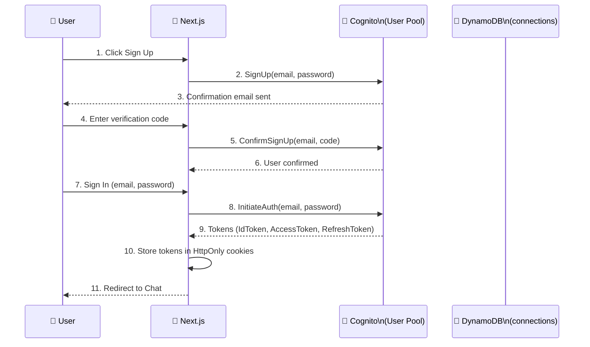
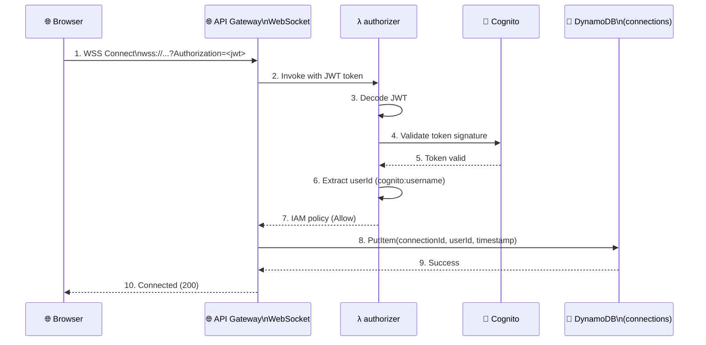
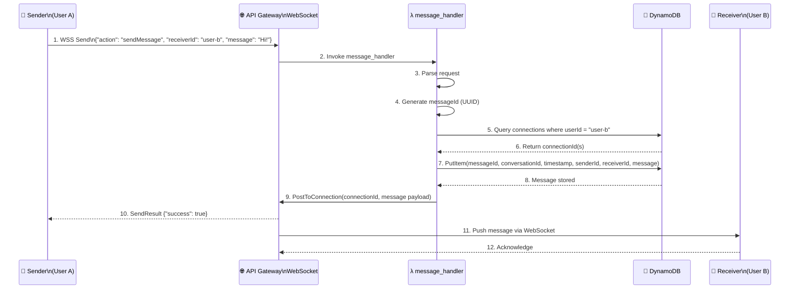
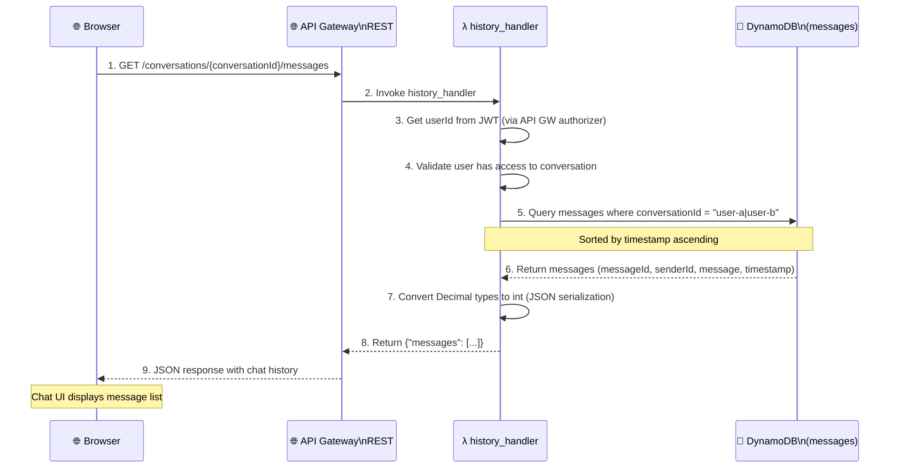
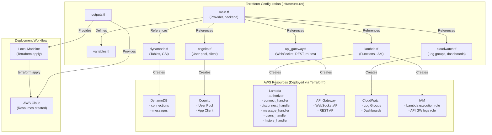
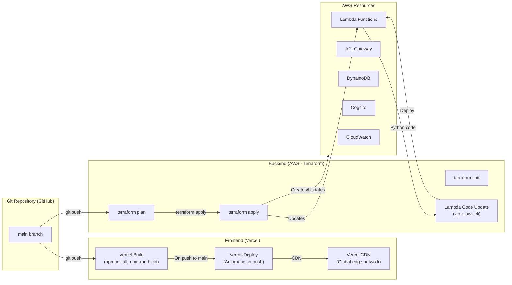
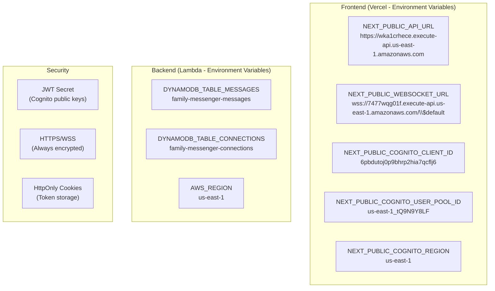

# High-Level Architecture Diagram

This document contains a comprehensive Mermaid diagram of the Family Messenger system.

## System Architecture

```mermaid
%%{init: {'theme': 'default', 'themeVariables': { 'primaryColor': '#4A90D9', 'primaryTextColor': '#fff', 'primaryBorderColor': '#2E5090', 'lineColor': '#666', 'secondaryColor': '#50A5E6', 'tertiaryColor': '#F0F4F8'}}}%%
flowchart TB
    subgraph CLIENT["👤 CLIENT LAYER"]
        Browser[\"🌐 Browser\n(Next.js App)\"]
    end

    subgraph FRONTEND["📱 FRONTEND (Vercel)"]
        VercelCDN["Vercel CDN\n(Static Assets)"]
    end

    subgraph AUTH["🔐 AUTHENTICATION (Cognito)"]
        CognitoUserPool["Cognito User Pool\nus-east-1_tQ9N9Y8LF"]
        CognitoClient["App Client\n6pbdutoj0p9bhrp2hia7qcflj6"]
    end

    subgraph BACKEND["⚙️ BACKEND (AWS Lambda + API Gateway) - Managed by Terraform"]
        subgraph APIGW["API Gateway"]
            WebSocketAPI["WebSocket API\nID: 7477wqg01f"]
            RESTAPI["REST API\nID: wka1crhece"]
        end

        subgraph LAMBDA["Lambda Functions (Python 3.13)"]
            Authorizer["authorizer\n(JWT Validation)"]
            ConnectHandler["connect_handler\n(Store connection)"]
            DisconnectHandler["disconnect_handler\n(Remove connection)"]
            MessageHandler["message_handler\n(Route messages)"]
            UsersHandler["users_handler\n(List users)"]
            HistoryHandler["history_handler\n(Load history)"]
        end

        subgraph IAM["IAM Roles"]
            LambdaExecutionRole["Lambda Execution Role\n(Least privilege)"]
        end
    end

    subgraph STORAGE["💾 DATA STORAGE (DynamoDB)"]
        ConnectionsTable["connections\n(connectionId → userId)"]
        MessagesTable["messages\n(conversationId, timestamp)"]
    end

    subgraph MONITORING["📊 MONITORING (CloudWatch)"]
        CloudWatchLogs["CloudWatch Logs\n(Lambda, API GW, Cognito)"]
        CloudWatchDashboards["Dashboards\n(Lambda metrics, API usage)"]
    end

    subgraph INFRA["🏗️ INFRASTRUCTURE (Terraform)"]
        TerraformState["Terraform State\n(S3 Backend)"]
        TerraformConfig["Terraform Config\n(infrastructure/)"]
    end

    Browser <-->|HTTPS/WSS| VercelCDN
    VercelCDN <-->|Fetch assets| Browser

    Browser -->|1. Sign up/Sign in| CognitoUserPool
    CognitoUserPool -->|2. Auth tokens| Browser
    CognitoClient -->|Validate| CognitoUserPool

    Browser -->|3. WSS Connect| WebSocketAPI
    WebSocketAPI -->|4. Invoke| Authorizer
    Authorizer -->|5. Validate JWT| CognitoUserPool
    Authorizer -->|6. Allow/Deny| WebSocketAPI
    WebSocketAPI -->|7. Store connection| ConnectHandler
    ConnectHandler -->|8. PutItem| ConnectionsTable

    Browser -->|9. Send message| WebSocketAPI
    WebSocketAPI -->|10. Route| MessageHandler
    MessageHandler -->|11. Query| ConnectionsTable
    MessageHandler -->|12. Store message| MessagesTable
    MessageHandler -->|13. PostToConnection| WebSocketAPI
    WebSocketAPI -->|14. Deliver message| Browser

    Browser -->|15. GET history| RESTAPI
    RESTAPI -->|16. Route| HistoryHandler
    HistoryHandler -->|17. Query| MessagesTable
    HistoryHandler -->|18. Return messages| RESTAPI
    RESTAPI -->|19. JSON response| Browser

    Browser -->|20. List users| RESTAPI
    RESTAPI -->|21. Route| UsersHandler
    UsersHandler -->|22. List users| CognitoUserPool

    ConnectHandler -->|Logs| CloudWatchLogs
    DisconnectHandler -->|Logs| CloudWatchLogs
    MessageHandler -->|Logs| CloudWatchLogs
    UsersHandler -->|Logs| CloudWatchLogs
    HistoryHandler -->|Logs| CloudWatchLogs
    WebSocketAPI -->|Logs| CloudWatchLogs
    RESTAPI -->|Logs| CloudWatchLogs

    TerraformConfig -->|Apply| APIGW
    TerraformConfig -->|Apply| LAMBDA
    TerraformConfig -->|Apply| ConnectionsTable
    TerraformConfig -->|Apply| MessagesTable
    TerraformConfig -->|Apply| CognitoUserPool
    TerraformConfig -->|Apply| CloudWatchLogs
    TerraformConfig -->|State| TerraformState
```

## User Authentication Flow



## WebSocket Connection Flow



## Real-Time Messaging Flow



## Message History Flow



## Data Model (DynamoDB)

```mermaid
erDiagram
    connections {
        string connectionId PK "WebSocket connection ID"
        string userId "Cognito username"
        number connectedAt "Unix timestamp"
        string endpoint "API Gateway endpoint"
    }

    messages {
        string conversationId PK "user-a|user-b (alphabetical)"
        number timestamp SK "Unix timestamp (sort key)"
        string messageId "UUID"
        string senderId "Sending user's ID"
        string receiverId "Receiving user's ID"
        string message "Message content"
    }

    connections ||--o{ messages : "stores history for"
```

## Infrastructure (Terraform-managed Resources)



## Deployment Flow



## Environment & Configuration



## Technology Stack Summary

| Layer | Technology | Purpose |
|-------|------------|---------|
| **Frontend** | Next.js, React, TypeScript | User interface |
| **Hosting** | Vercel | Frontend deployment |
| **Auth** | AWS Cognito | User authentication |
| **API** | AWS API Gateway | WebSocket + REST endpoints |
| **Compute** | AWS Lambda | Backend logic (Python) |
| **Database** | AWS DynamoDB | Messages + connections storage |
| **Infrastructure** | Terraform | Backend resource management |
| **Monitoring** | AWS CloudWatch | Logs, metrics, dashboards |

## Resource Reference

| Resource | Identifier/Value |
|----------|------------------|
| **Frontend URL** | https://sanketmessenger.vercel.app |
| **WebSocket API** | 7477wqg01f |
| **REST API** | wka1crhece |
| **Cognito User Pool** | us-east-1_tQ9N9Y8LF |
| **Cognito App Client** | 6pbdutoj0p9bhrp2hia7qcflj6 |
| **DynamoDB Tables** | family-messenger-messages, family-messenger-connections |
| **Lambda Functions** | authorizer, connect_handler, disconnect_handler, message_handler, users_handler, history_handler |
| **Region** | us-east-1 |